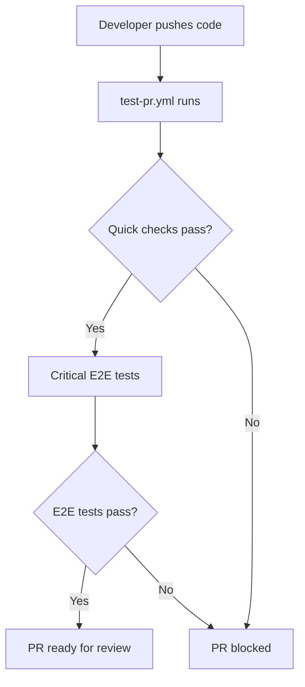
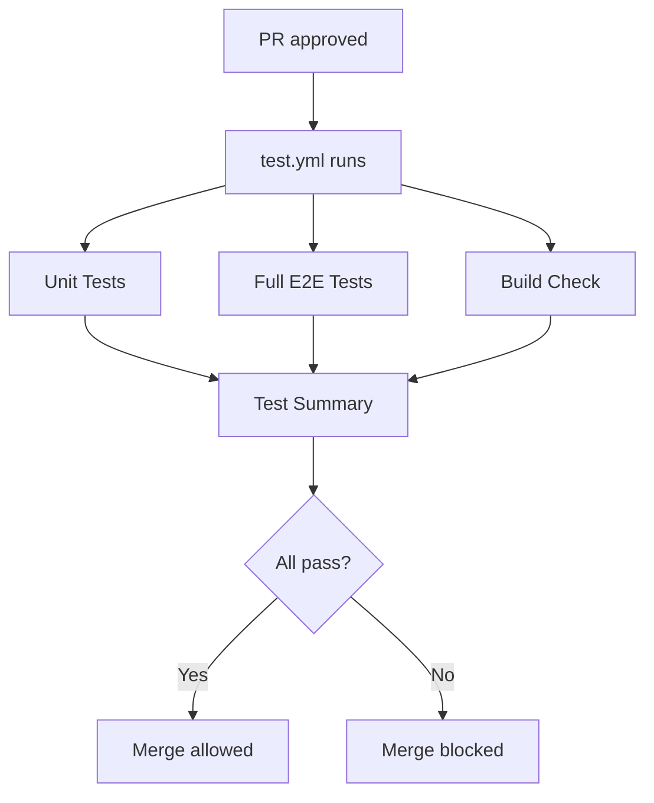
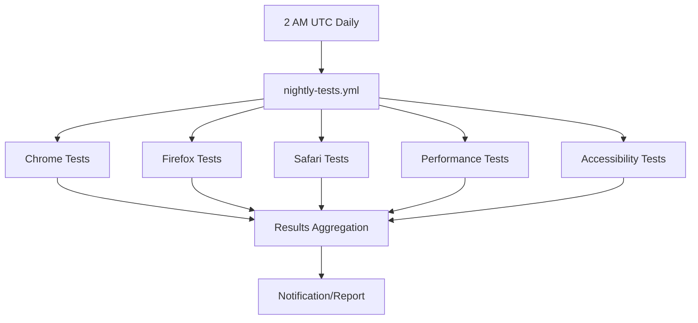

# GitHub Actions Workflows

This directory contains automated testing and CI/CD workflows for the codac application.

## 📁 Workflow Files

### 🚀 Primary Workflows

#### `test.yml` - Main Test Suite
**Triggers:** Push to `main`/`develop`, Pull Requests  
**Purpose:** Comprehensive testing including unit tests, e2e tests, and build verification

**Jobs:**
- **Unit Tests** - Runs Jest tests with coverage reporting
- **E2E Tests** - Full Playwright test suite across all browsers
- **Build Check** - Verifies the application builds successfully
- **Test Summary** - Aggregates results and reports overall status

#### `test-pr.yml` - Pull Request Tests
**Triggers:** Pull Request events (opened, synchronize, reopened)  
**Purpose:** Fast feedback for PRs with essential tests only

**Jobs:**
- **Quick Checks** - Linting, formatting, type checking, unit tests
- **Critical E2E** - Key e2e tests (auth, navigation) in Chromium only

#### `nightly-tests.yml` - Comprehensive Nightly Testing
**Triggers:** Daily at 2 AM UTC, Manual dispatch  
**Purpose:** Extensive testing including performance and accessibility

**Jobs:**
- **Cross-browser E2E** - Full test suite across Chrome, Firefox, Safari
- **Performance Tests** - Lighthouse performance analysis
- **Accessibility Tests** - Automated accessibility compliance checking
- **Notifications** - Summary reporting (can be extended with Slack/Discord)

## 🎯 Testing Strategy

### Development Workflow


### Main Branch Protection


### Nightly Quality Assurance


## ⚙️ Configuration

### Environment Variables
Required secrets in your GitHub repository:

```bash
# Production environment variables (if needed for build)
NEXTAUTH_SECRET=your_nextauth_secret
```

### Package.json Scripts
Added CI-specific scripts:

```json
{
  "test:ci": "jest --coverage --watchAll=false --ci --passWithNoTests",
  "test:e2e:ci": "playwright test --reporter=github",
  "test:e2e:headed": "playwright test --headed",
  "test:e2e:debug": "playwright test --debug"
}
```

## 📊 Test Coverage & Reporting

### Unit Test Coverage
- Jest generates coverage reports automatically
- Coverage uploaded to Codecov (if token provided)
- Coverage threshold can be configured in `jest.config.js`

### E2E Test Reporting
- Playwright generates HTML reports for all test runs
- Test artifacts (screenshots, videos) uploaded on failures
- GitHub annotations for failed tests in PR reviews

### Performance Monitoring
- Lighthouse reports generated nightly
- Performance budgets can be configured
- Regression detection for performance metrics

## 🔧 Optimization Features

### Caching Strategy
- **pnpm cache** - Dependencies cached between runs
- **Playwright browsers** - Browser binaries cached
- **Build cache** - Next.js build cache optimization

### Parallel Execution
- Unit and E2E tests run in parallel jobs
- Cross-browser testing uses matrix strategy
- Fail-fast disabled for comprehensive reporting

### Resource Management
- **Artifact retention** configured by importance:
  - Critical results: 30 days
  - Test reports: 7-14 days
  - PR artifacts: 3 days

## 🚦 Status Badges

Add these badges to your README.md:

```markdown


```

## 🔧 Maintenance

### Adding New Tests
1. Add test files to appropriate `e2e/` directories
2. Tests automatically picked up by existing workflows
3. Consider adding critical tests to PR workflow

### Customizing Workflows
1. **Performance budgets** - Modify Lighthouse configuration
2. **Browser support** - Add/remove browsers in matrix strategy
3. **Notification channels** - Configure Slack/Discord webhooks
4. **Test schedules** - Adjust cron expressions for nightly runs

### Troubleshooting
- **Browser installation failures** - Check Playwright version compatibility
- **Test timeouts** - Adjust timeout values in `playwright.config.ts`
- **Build failures** - Verify environment variables are set correctly
- **Cache issues** - Clear workflow caches in GitHub Actions settings

## 📈 Metrics & Monitoring

### Key Metrics Tracked
- **Test execution time** - Monitor for performance regressions
- **Test success rate** - Track flaky tests
- **Coverage percentage** - Ensure adequate test coverage
- **Performance scores** - Lighthouse metrics trending

### Recommended Monitoring
- Set up alerts for consistent test failures
- Monitor test execution time trends
- Track coverage changes over time
- Performance regression alerts

## 🎯 Best Practices

### For Developers
- Run `pnpm test:e2e:headed` locally before pushing
- Use `pnpm test:e2e:debug` for debugging failing tests
- Keep tests focused and deterministic
- Update tests when changing UI components

### For Maintainers
- Review test reports in PR reviews
- Monitor nightly test results regularly
- Update browser versions periodically
- Maintain test data and fixtures 